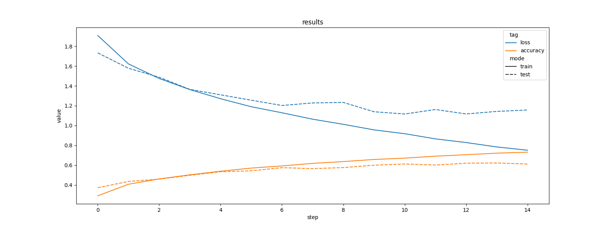

# Execution:
Open tensorboard by navigating to Homework5 and running `tensorboard --logdir logs/`. 

# Files: 
* [logs](logs): contains the logs for all the test runs
* [csvs](csvs): contains csvs with the results from the test runs
* [Plots](Plots): contains images of the plots
* [main.py](main.py): only used for execution
* [training_loop.py](training_loop.py): contains one full training loop and the LogWriter
* [model.py](model.py): creation of MyCNNNormalizationLayer, MyCNNBlock and MyCNN class, containing train step and test step and metrices
* [get_data.py](get_data.py): contains all functions to load, preprocess and augment the data

# Overfitting: 
1. We already tried to minimize overfitting in last weeks homework by choosing a simple architecture with good expressivity (best amount of parameters). Because this also optimizes leanability and performance. 
We also normlized the data back then.  

You can see a slight overfitting, as there is a big difference in the curves of training and validation after about step 6. 
 

2. DenseNet / ResNet: Skip connections help to improve the vanishing gradients problem and are specifically helpful for larger networks. The earlier input is concatenated (DenseNet) or added (ResNet) to the output. We did that for every block, not for every layer using ...
3. BatchNormalization layers: Avoids overfitting, provides regularization and can improve learning speed. It normalizes the output of one layer before it is given to the next layer. 
4. Dropout layers: Prevents overfitting. During training it randomly switches some percentage of neurons of network on and off. 
5. L2 Regularizer: Regularizes the loss by controlling the models complexity. We decided to use L2, because when using L1 you get small parameter values, because the absolute value is reduced. With L2 the square is minimized and therefore the biggest values are reduced. 

description
 

You can find all plots separately in [Plots](plots). 