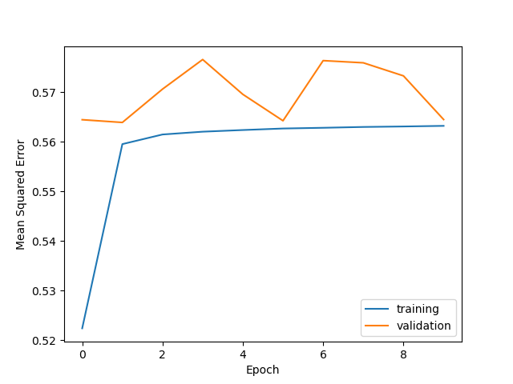
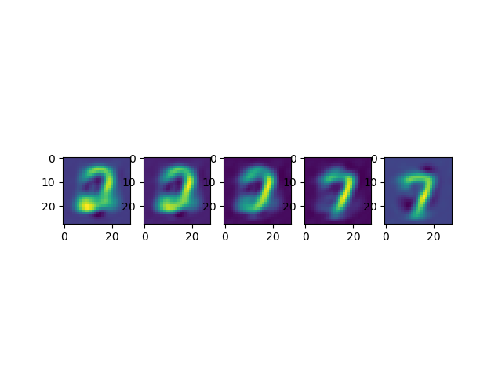

# Files: 
* [logs](logs): contains the tensorboard logs for all the runs
* [Plots](Plots): contains all saved plots
* [main.py](main.py): only used for execution and creating all the analysis and plots. These files do contain the training as we used compile and fit instead of writing our own training loop
* [model.py](model.py): creation of MyCNNBlock, MyCNNNormalizationLayer, MyCNN as an encoder, MyDecoder and MyAutoencoder
* [get_data.py](get_data.py): contains all functions to load and preprocess the mnist data
* [saved_model](saved_model): contains the total saved models
* [saved_encoder](saved_encoder): contains all the saved encoders
* [saved_decoder](saved_decoder): contains the saved decoders

Plot of training results with 10 epochs in run 1. The Embedding was of size 10. 
 

# Latent Space Analysis

The embeddings for the first 1000 validation set images, reduced to two dimensions. 
 
Evaluation

An Interpolation between two embeddings created by the decoder. 
 