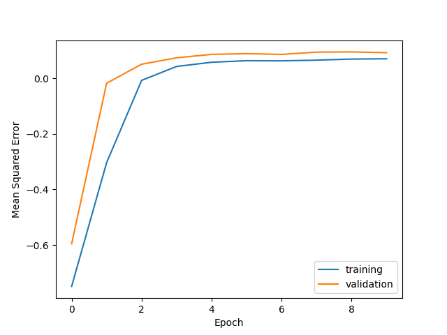

# LSTM
We programmed our own LSTM cell by using AbstractRNNCell. It is supposed to approximate the cumulative sum of a sequence of images, where every second image is substracted instead of added. 

Plot of training results with 15 epochs in run 1. The LSTM had 15 Units
 

# Files: 
* [logs](logs): contains the tensorboard logs for all the runs
* [main.py](main.py): only used for execution or if preferred use [main.ipynb] instead. These files do contain the training as we used compile and fit instead of writing our own training loop
* [model.py](model.py): creation of MyCNNBlock and MyLSTMCell and MyLSTMModel, containing train step and test step and metrices
* [get_data.py](get_data.py): contains all functions to load and preprocess the data
* [saved_model](saved_model): contains all saved models